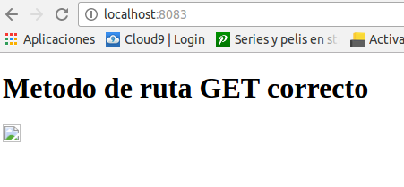
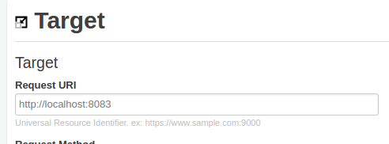
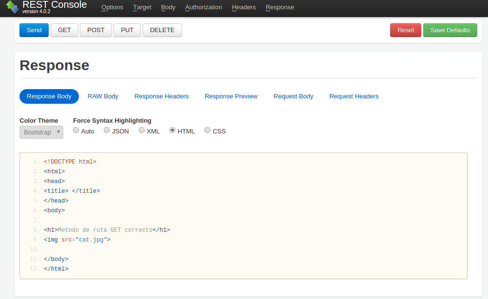
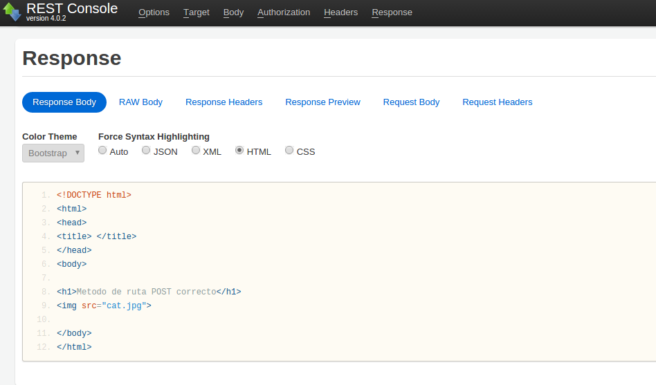

# Direccionamiento en Express
El direccionamiento hace referencia a la determinación de cómo responde una aplicación a una solicitud de cliente en un determinado punto final, que es un URI (o una vía de acceso) y un método de solicitud HTTP específico (GET, POST, etc.).

## Métodos de ruta
Se derivan de uno de los métodos HTTP y se adjuntan a una instancia de la clase express.

Como se puede observar en la carpeta **/src** hemos definido un ejemplo **server.js** ilustrando el uso del método GET y POST. A continuación mostramos unas capturas de su funcionamiento:

* En primer lugar lanzamos el servidor en nuestra máquina local, siendo visible en el puerto 8083 escribiendo en nuestro navegador
```
localhost:8083
```
<div style="text-align:center"></div>

Para poder diferenciar las diferentes peticiones como GET o POST y poder corroborar que estas están funcionando correctamente, utilizamos una herramienta que nos permitirá visualizar el resultado de GET, POST... o el método definido.

* Primero escribimos la dirección de nuestro servidor:

* Para GET:
<div style="text-align:center"></div>
<br>

* Para GET:
<div style="text-align:center"></div>
<br>
* Para POST:
<div style="text-align:center"></div>
<br>

Ambas peticiones nos llevan a un archivo .html distinto como se ve en las imágenes, así lo definimos en nuestro server.js.
